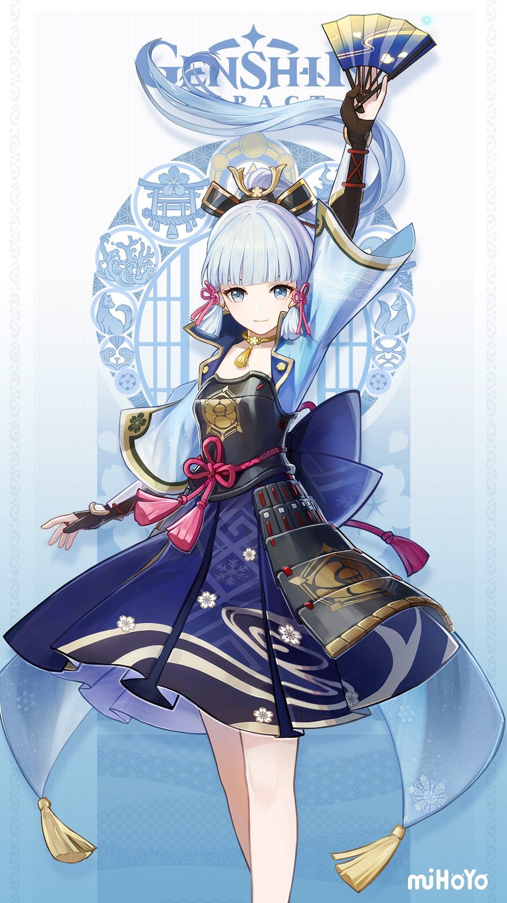

# Kamisato Ayaka Tone Generation Based on Coqui TTS

This project is based on the Chinese pre-training model in [Coqui TTS]([https](https://github.com/coqui-ai/TTS)) and the dataset in [Hugging Face](https://huggingface.co/datasets/xmj2002/genshin_ch_10npc) to simulate the timbre of Kamisato Ayaka.

